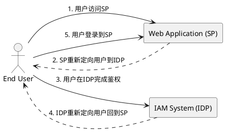
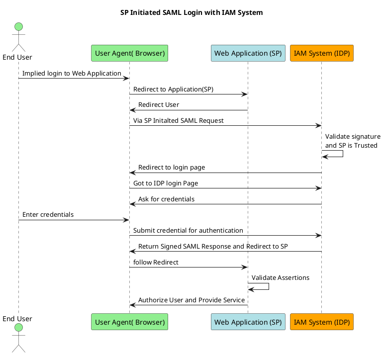
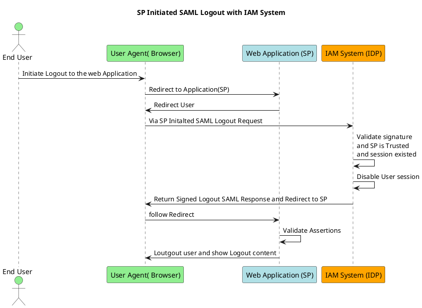

## 介绍

### SAML协议

SAML( Security Assertion Markup Language)是一种标准化的身份认证协议，主要用于在不同的域（比如不同服务）之间安全地交换身份验证和授权数据。其技术文档可以在 [OASIS(结构化信息标准促进组织)](https://docs.oasis-open.org/security/saml/Post2.0/sstc-saml-tech-overview-2.0.html)官方网站查看。

简要流程如下：



<!--more-->

## SAML协议中的概念

### SP(Service Provider)

服务提供商（SP）是一个提供服务的实体，比如一个网站或应用。用户希望通过SP访问资源。在SAML身份认证过程中，SP是请求和接收关于用户身份信息的一方。

### IDP(Identity Provider)

身份提供商（IDP）是负责认证用户身份并将这些信息提供给服务提供商的系统。在SAML流程中，当用户试图登录服务提供商提供的服务时，IDP负责验证用户的身份，并向SP发送断言来确认这一身份。

### Metadata（元数据）

在SAML中，元数据是用来描述IDP（身份提供商）和SP（服务提供商）的配置信息的XML文档。它包括了以下几类重要信息：

* 实体描述符：标识实体（IDP或SP）并包括关于实体的信息，如实体ID和服务位置。
* 服务终点：提供服务地址，比如哪里可以发送SAML请求（如认证请求）或哪里可以接收SAML响应（如认证响应）。
* 密钥信息：用于签名和加密消息的公开密钥信息，确保信息的安全性。
* 协议支持信息：说明实体支持哪些SAML协议的功能。
  
元数据的交换在SP和IDP之间建立信任关系和技术配置时进行。例如，在配置过程中，SP和IDP会相互提供自己的元数据，从而确保双方都有正确的信息来安全地发送和接收SAML消息。

### SAML断言

SAML断言是由IDP创建并发送给SP的一种消息，它包含了验证用户身份的信息。断言通常包括以下几个部分：

* 断言ID：一个唯一标识符，用于区分不同的断言。
* 发行者：创建断言的IDP的标识。
* 主题：关于用户的信息，通常包括用户的唯一标识符和可能的会话索引。
* 条件：定义断言有效性的时间窗口和接收断言的SP的约束。
* 属性声明：具体的用户属性，如用户名、邮箱、角色等。
* 身份验证声明：包含用户身份验证成功的时间和方法的信息。

在实际应用中，当用户尝试访问SP的资源时，SP会将用户重定向到IDP进行身份验证。用户在IDP成功认证后，IDP会创建一个SAML断言，包含用户的身份和属性信息，并将其发送回SP。SP接收到断言后，会验证断言的签名，确认其来自可信的IDP，并根据断言中的信息决定是否授权用户访问请求的资源。

## 流程图





## 验证

为了便于验证 SAML 协议，我们将使用 Docker 来搭建环境，keycloak的作为IDP，WordPress作为SP，用来演示SAML登陆流程。在生产环境下，应该根据实际情况配置和准备环境。

### 准备Docker镜像

准备docker-compose，并创建sp和idp需要的相关文件。

* 参考<https://docs.docker.com/compose/install/> 安装你的docker-compose环境,安装完成后使用```docker-compose -v```检查docker-compose是否安装成功

     ```bash
     $ sudo docker-compose -v
     docker-compose version 1.29.2, build unknown
     ```

* 创建一个demoiam文件夹,按照下面结构创建文件，也可以直接从 <https://github.com/lich-wang/demoiam> 获取配置好的文件

  ```bash
  $ tree ~/demoiam/
    demoiam/
    ├── testidp
    │   └── docker-compose.yml
    └── testsp
        └── docker-compose.yml
  ```

  * 配置testidp/docker-compose.yml 如下

  ```yml
  version: '3'
  services:
  keycloak:
      image: keycloak/keycloak
      ports:
      - "20000:8080"
      environment:
      KEYCLOAK_ADMIN: admin
      KEYCLOAK_ADMIN_PASSWORD: admin
      command:
      - start-dev
      volumes:
      - keycloak_data:/opt/jboss/keycloak/standalone/data

  volumes:
  keycloak_data:
  ```

  * 配置testspdocker-compose.yml 如下

   ```yml
  version: '3'
  services:

  wordpress:
      image: wordpress
      restart: always
      ports:
      - 20001:80
      environment:
      WORDPRESS_DB_HOST: db
      WORDPRESS_DB_USER: exampleuser
      WORDPRESS_DB_PASSWORD: examplepass
      WORDPRESS_DB_NAME: exampledb
      volumes:
      - wordpress:/var/www/html

  db:
      image: mysql:8.0
      restart: always
      environment:
      MYSQL_DATABASE: exampledb
      MYSQL_USER: exampleuser
      MYSQL_PASSWORD: examplepass
      MYSQL_RANDOM_ROOT_PASSWORD: '1'
      volumes:
      - db:/var/lib/mysql

  volumes:
  wordpress:
  db:
   ```

### 初始化IDP

* 进入IDP路径，启动环境

  ```bash
  $ cd ~/demoiam/testidp/
  $ sudo docker-compose up -d
  Creating network "testidp_default" with the default driver
  Creating volume "testidp_keycloak_data" with default driver
  Creating testidp_keycloak_1 ... done
  ```

* 进入控制台，创建一个新用户
  * 打开 <http://localhost:20000/> 输入 用户名```admin```密码```admin```，进入控制台
  
  * 从左侧导航进入```Users```页面，点击```Add User```创建一个新用户
    * 在```Username```后输入用户名```test1```，点击```Create```创建用户
    * 创建成功后，点击```test1```用户的```credentials```标签，点击```Set Password``` 为用户创建密码
    * 在```Password```和```Password confirmation```分别输入```test1```作为密码,然后点击```Save```为用户保存密码

* 导出IDP的SAML元数据
  在左侧导航栏点击```Realm Settings```下划到最后,右键点击```SAML 2.0 Identity Provider Metadata```另存链接为IDP.xml

### 初始化SP

* 进入IDP路径，启动环境

  ```bash
  $ cd ~/demoiam/testsp/
  $ sudo docker-compose up -d
  Creating network "testsp_default" with the default driver
  Creating volume "testsp_wordpress" with default driver
  Creating volume "testsp_db" with default driver
  Creating testsp_db_1        ... done
  Creating testsp_wordpress_1 ... done
  ```

* 完成SP 初始化，并启用SAML集成
  * 打开 <http://localhost:20001/> 选择语言```简体中文```后,点击```继续``完成配置
  * 设置用户名```admin```密码```w0rd@Press```邮箱```admin@admin.com```后，点击```安装WordPress```
  * 点击登陆，在登陆页面输入刚才设置的用户名```admin```密码```w0rd@Press```后，点击```登陆```
  * 登陆后,添加SAML插件启用SAML登陆
    * 点击左侧导航页```插件```下的```添加插件```，在右侧搜索输入```SAML```选择```SAML Single Sign On – SSO Login```安装，并```启用```
    * 刷新页面页面后,在左侧导航栏新出现的```SAML Single Sign On – SSO Login```下点击```Service Provider Metadata```页签
    * 点击```Metadata XML File``` 下的```DownLoad```下载SP元数据，并将下载后的文件修改为```sp.xml```

### 配置SAML元数据

* SP 导入IDP元数据
  * 打开 <http://localhost:20001/> 用之前设置用户名```admin```密码```w0rd@Press```登陆
  * 从左侧导航栏的```SAML Single Sign On – SSO Login```进入```Service Provider Setup```页签
  * 在```Configure Service Provider```下选择```Upload IDP Metadata```
    * ```Identity Provider Name :```输入```testidp```
    * ```Upload Metadata :```选择之前下的```idp.xml```
    * 点击```upload```上传
* IDP导入SP元数据
  * 打开 <http://localhost:20000/> 输入 用户名```admin```密码```admin```，进入控制台
  * 点击左侧```Clients```页签，选择```Import client```
    * 在```Resource file```右侧点击```Browse...```选择之前下载的```sp.xml```,后点击```Save```。

### 使用SAMLTrace进行调试跟踪

为方便后续调整，这里举例使用Edge浏览器并安装SAMLTrace扩展，使用隐私模式进行SAML验证

* 安装SAMLTrace
  * 用Edge浏览器打开 <https://microsoftedge.microsoft.com/addons>
  * 搜索```saml tracer```,并安装搜索到的```SAML, WS-Federation and OAuth 2.0 tracer```
  * 在Edge浏览器打开[edge://extensions/](edge://extensions/)，选择```SAML, WS-Federation and OAuth 2.0 tracer```的```详细信息```
    -勾选 ```在 InPrivate 中允许```
* 使用Edge的隐私模式进行SAML验证
  * 在Edge浏览器右侧```...```设置列表内找到```新建Inprivate窗口```或者按下快捷键```Ctrl+Shift+N```
  * 在隐私模式下访问 <http://localhost:20001/wp-login.php，并点击> ```Login with testdip```
    * 页面跳转到 IDP登录页面
    * 在IDP登录页输入之前配置的用户名```test1```密码```test1```并登录
    * 在IDP登录重置初始密码为```test2```
    * 页面跳回SP，并登录成功
  * 点击地址栏右侧扩展图标，点击打开```SAMLTrace```可以查看相关SAML请求