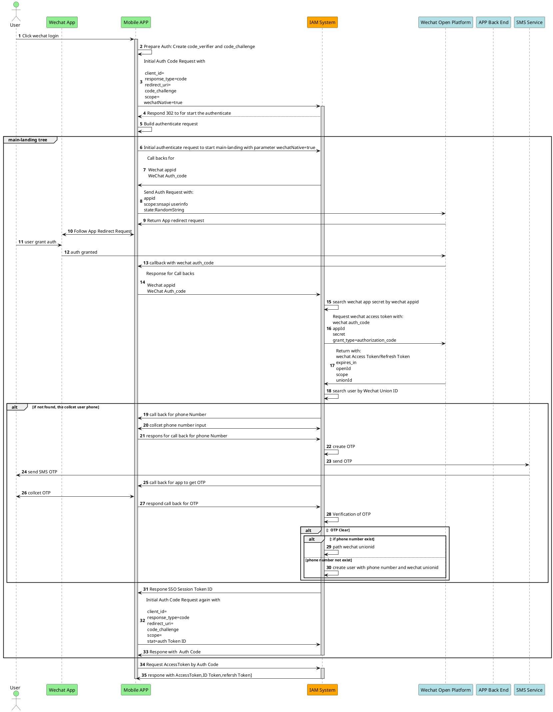

```plantuml
@startuml
actor "User" as user #lightgreen
participant "Wechat App" as wechat#lightgreen
participant "Mobile APP" as app#lightgreen
participant "IAM System" as fr#orange
participant "Wechat Open Platform" as openapi#powderblue
participant "APP Back End" as APIM#powderblue
participant "SMS Service" as sms#powderblue

autonumber 


user->app: Click wechat login
activate app #DDDDDD

app ->app : Prepare Auth: Create code_verifier and code_challenge 

app->fr:  Initial Auth Code Request with \n\n client_id= \n response_type=code \n redirect_uri= \n code_challenge \n scope= \nwechatNative=true  
activate fr #DDDDDD
 
app<--fr: Respond 302 to for start the authenticate
app->app: Build authenticate request

group main-landing tree

app->fr:Initial authenticate request to start main-landing with parameter wechatNative=true 


fr -> app: Call backs for \n\n Wechat appid \n WeChat Auth_code  \n 

 
app-> openapi:Send Auth Request with:\nappid\nscope:snsapi userinfo\nstate:RandomString
app<- openapi:  Return App redirect request
app<->wechat:  Follow App Redirect Request
user->wechat:  user grant auth
wechat->openapi: auth granted
openapi->app:  callback with wechat auth_code
app ->fr:Response for Call backs \n\n Wechat appid \n WeChat Auth_code  

fr->fr: search wechat app secret by wechat appid
fr->openapi:Request wechat access token with:\nwechat auth_code\nappId\nsecret\ngrant_type=authorization_code
fr<-openapi: Return with:\nwechat Access Token/Refresh Token\nexpires_in\nopenId\nscope\nunionId
fr->fr: search user by Wechat Union ID 

alt if not found, the collcet user phone 
fr->app: call back for phone Number
app<->fr: collcet phone number input
app ->fr: respons for call back for phone Number
fr ->fr :create OTP
fr-> sms: send OTP
sms-> user:send SMS OTP
fr-> app:call back for app to get OTP
app<->user:collcet OTP
app->fr:respond call back for OTP
fr->fr:Verification of OTP
alt :  OTP Clear 
alt : if phone number exist
fr->fr: path wechat unionid 
else phone number not exist
fr->fr: create user with phone number and wechat unionid  
end
end
end
fr->app: Respone SSO Session Token ID 
app->fr: Initial Auth Code Request again with \n\n client_id= \n response_type=code \n redirect_uri= \n code_challenge \n scope= \n stat=auth Token ID
fr->app: Respone with  Auth Code
deactivate fr

end

app->fr: Request AccessToken by Auth Code
activate fr #DDDDDD
fr->app: respone with AccessToken,ID Token,refersh Token]
deactivate fr
deactivate app

@enduml
```