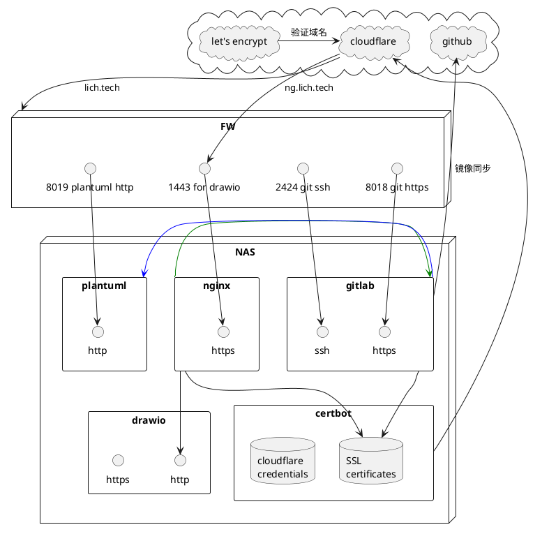

```plantuml
@startuml
skinparam componentStyle rectangle

cloud {
    cloud "let's encrypt" as le
    cloud cloudflare as cf
    cloud github 
}

node FW {
     
    () "8019 plantuml http" as 8019
    () "1443 for drawio" as 1443    
    () "8018 git https" as 8018
    () "2424 git ssh" as 2424
}

node NAS {
    component gitlab {
        () "https" as githttps
        () "ssh" as gitssh
    }
    component "nginx" as ng {
        () "https" as nghttps
    }
    component drawio {
        () "http" as drawiohttp
        () "https" 
    }
    component certbot as cb {
        database "SSL \ncertificates" as ssl
        database "cloudflare \ncredentials"
    }
    component "plantuml" as uml {
        () "http" as umlhttp
    }
}

cf -d-> FW: lich.tech
cf -d-> 1443: ng.lich.tech
le -> cf: 验证域名
github <-d- gitlab: 镜像同步
8018 -d-> githttps
2424 -d-> gitssh
1443 -d-> nghttps
8019 -d-> umlhttp
ng -d-> drawiohttp

ng -> gitlab #green
gitlab ->uml #blue

ng -d-> ssl
gitlab -d-> ssl
cb -u-> cf
@enduml


```

<!--more-->

