## 第一天(到达)

### 6-26 周三

#### 14:34 南京出发抵达西安北

#### 15:26 淮安出发抵达西安北

#### 16:30 抵达西安雁塔区曲江6号

地铁2号线（常宁官方向）华侨，下车打车1.1公里至终点，打车2公里，抵达西安雁塔区曲江6号，1号公寓楼
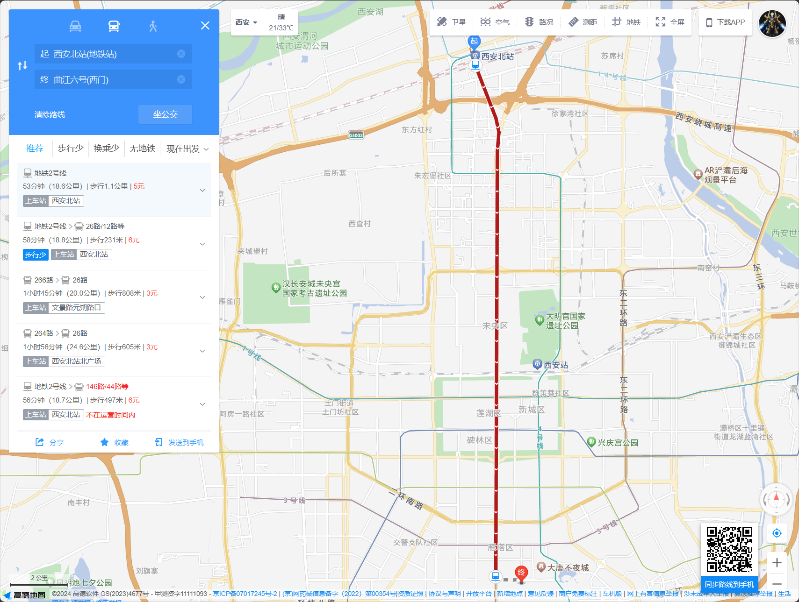

## 第二天(兵马俑+华清池)

### 6-27 周四

#### 7:20 西安雁塔区曲江6号出发

西安雁塔区曲江6号出发，地铁2号线到钟楼北，秦之风兵马俑直通车·钟楼线,约10点抵达兵马俑博物馆。
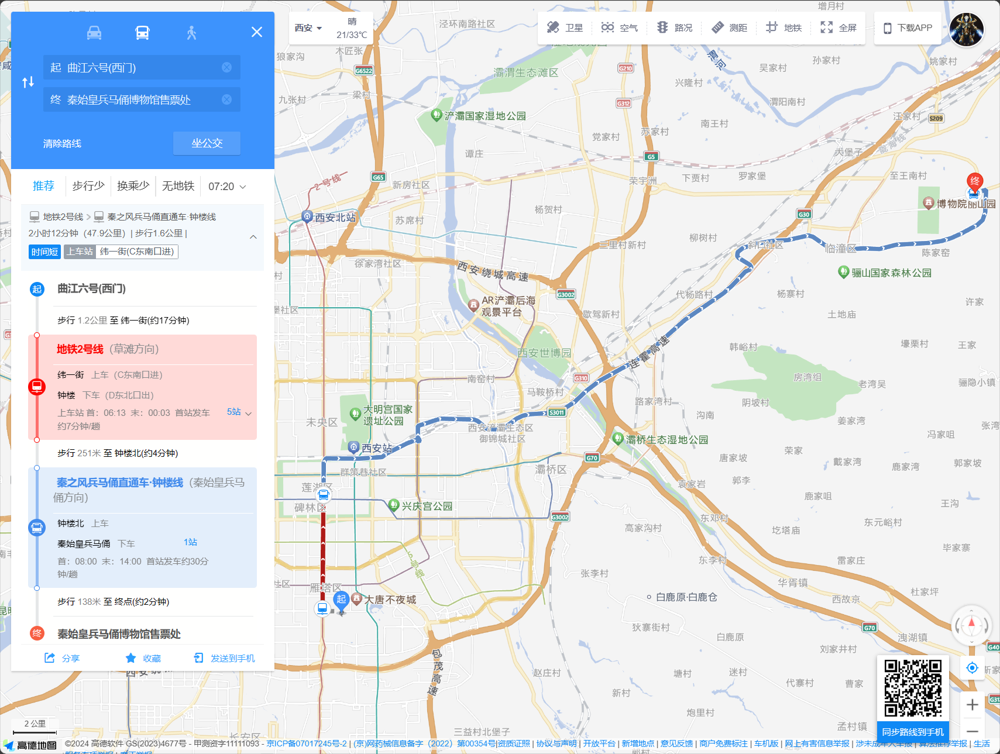

#### 10:00 抵达秦始皇兵马俑博物馆

秦始皇兵马俑博物馆约两小时，12点前后结束。
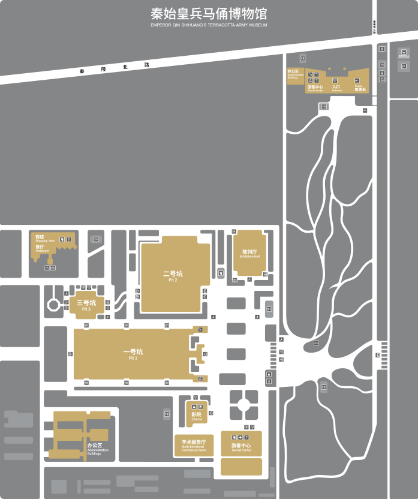

#### 12:00 抵达秦始皇帝陵博物院

秦始皇帝陵博物院丽山园约两小时，2点前后结束。
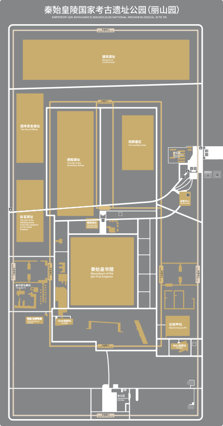

#### 14:00 前往华清池

从秦始皇帝陵博物院丽山园前往华清池，预计3点到点。
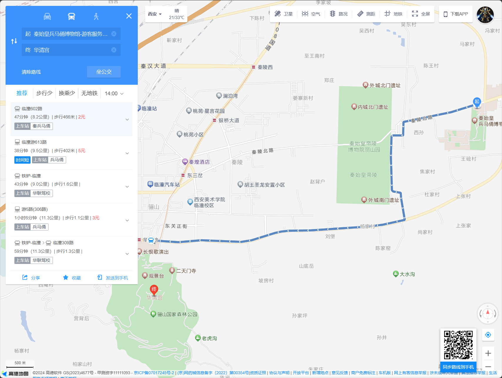

#### 15:00 抵达华清池

1小时游览华清池。
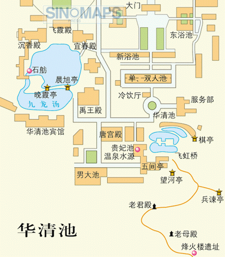

#### 16:00 返回曲江6号

从华清池返回曲江6号,预计1.5小时。
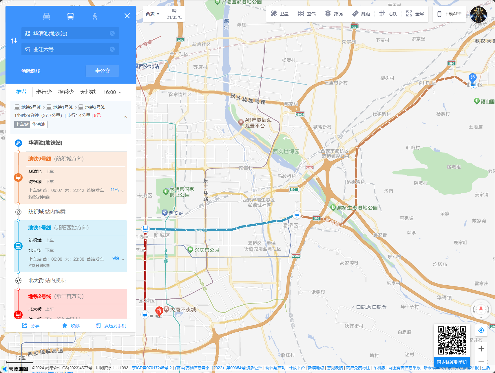

## 第三天(陕西博物馆+大雁塔+演出)

### 6-28 周五

#### 8:00 选择1:大雁塔，唐大慈恩寺遗址公园

大雁塔，唐大慈恩寺遗址公园
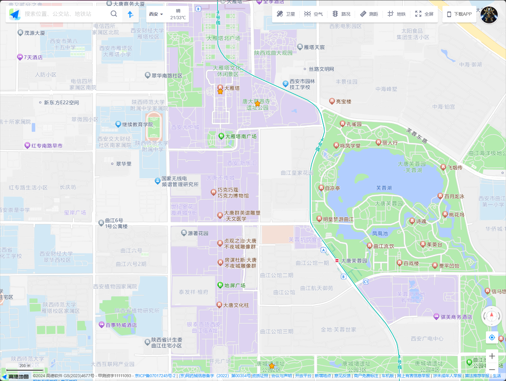

#### 15:00 前往观看17点场驼铃传奇

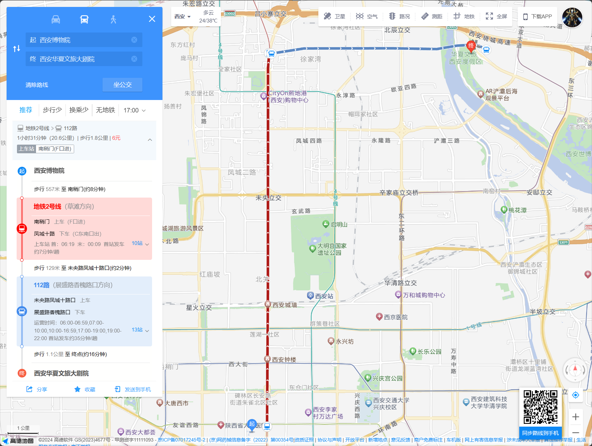

## 第四天(西安博物院+钟鼓楼+西安城墙+永兴坊)

### 6-29 周六

#### 9:00 前往西唐客栈

12路 47分钟 从曲江6号到西唐客栈
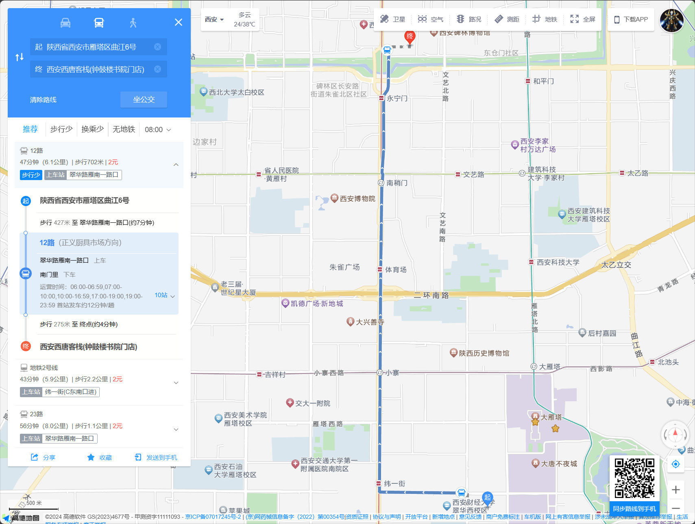
上午钟楼/鼓楼
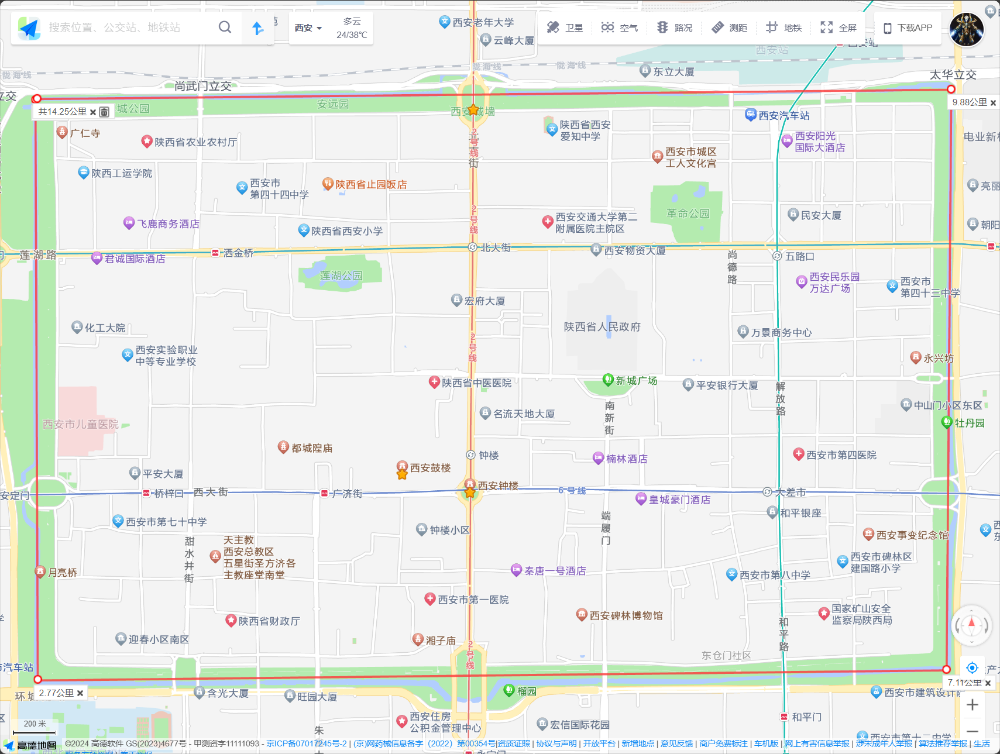

#### 11:00 :前往西安博物院

11点前后，3公里打车到西安博物院
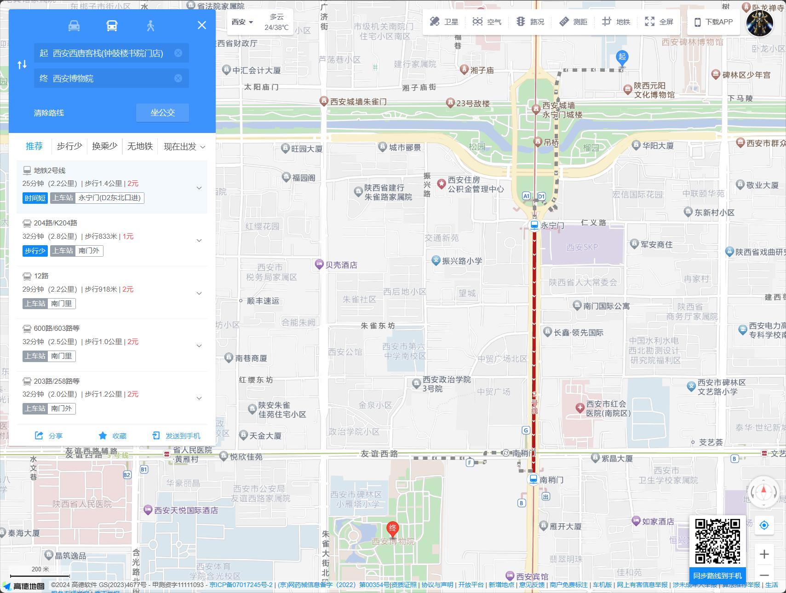
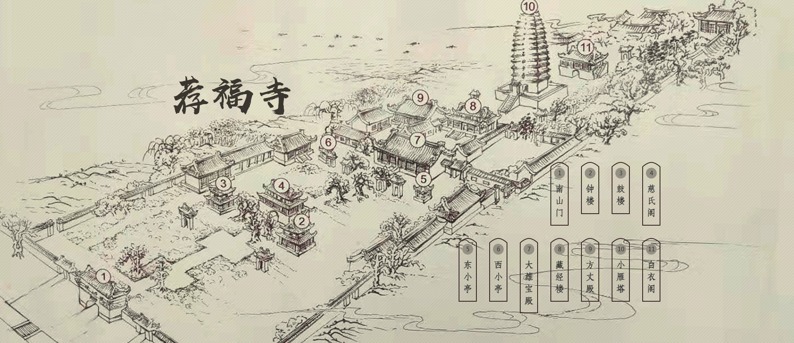

#### 13:00 :西安城墙

#### 17:00 :永兴坊

## 第五天(大明宫国家遗址公园+返回)

### 6-30 周日

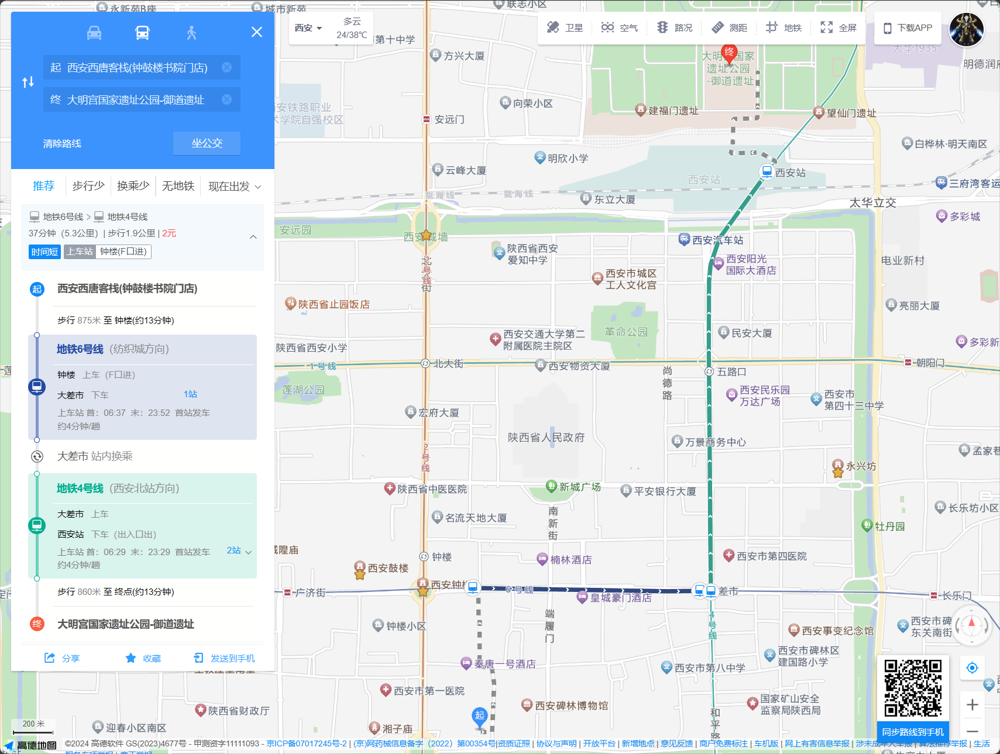
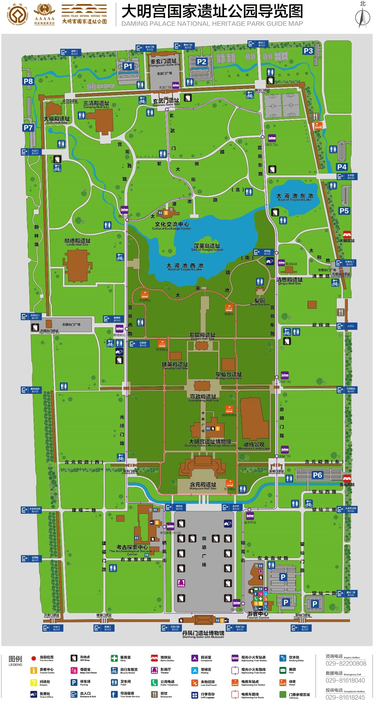